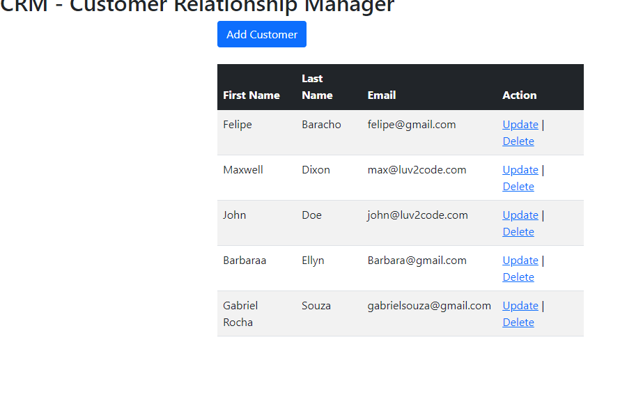
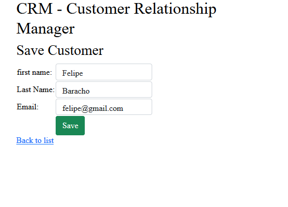
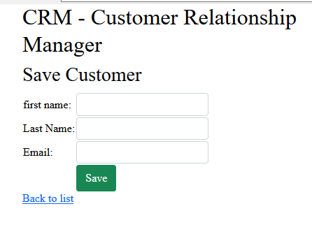
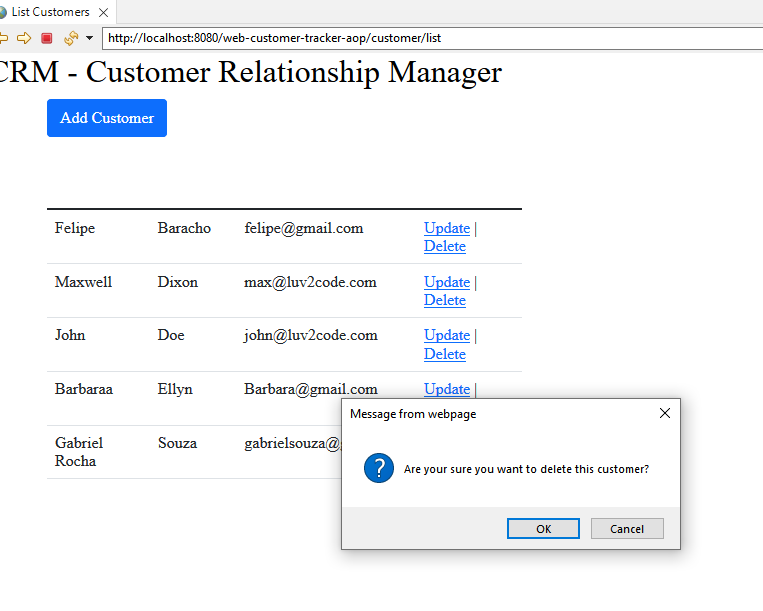

# JAVA SPRING MVC AND HIbernate - Crud register of Seller.

=

## 🖼 Screenshot application screen  

List Seller

 
 

Update Seller

 
 

Register Seller

 
 

Delete

 
 

AOP Logger

 
 

 
## 🚀 Tech Used 
 

- SPRING MVC 
- MYSQL  
- html e css  
- Hibernate 
- AOP Logger  
- Bootstrap
 

## Linkedin below

<h4 align="center">
   Created by   <a href="https://www.linkedin.com/in/luiz-carlos-b50693173/" target="_blank"> Luiz Carlos </a>
</h4>

</html>
